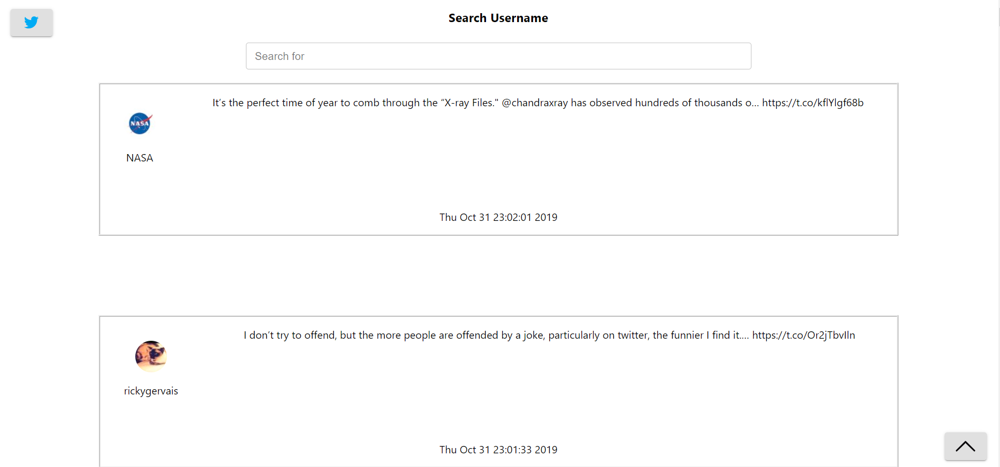
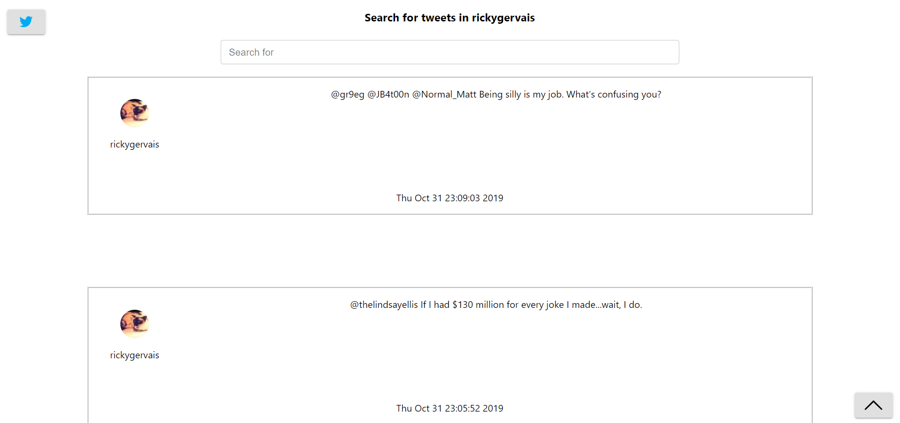

### Twitter Client Description

I have created a simple client that gets the top 50 most recent tweets from my home timeline. There is the search bar for both finding twitter handler and finding tweets with keywords. Finding username can only be done on the main timeline. Only when the user finds the handle, then only the search bar (minimum 4 characters) can be used for finding texts. Also UI updates with recent tweets (50 most recent) every 5 seconds on the twitter handle page. I have added two buttons, one is for going to the main timeline (top left) and a utility button (bottom right) that scrolls to the top of the page.

### Tech stack

1. Express for backend.
2. React for frontend.

### Deployment

For backend

1. Run `cd twitter-backend`
2. Run `npm install`
3. Run `npm start`

For frontend

1. Run `cd twitter-frontend`
2. Run `npm install`
3. Run `npm start`

### Screenshots

Main feed

User feed

